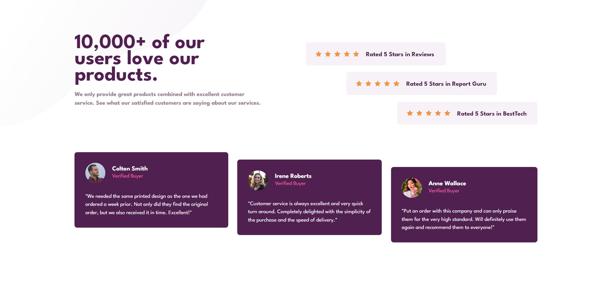

# ⭐ Social Proof Section – Frontend Mentor Challenge

> A responsive social proof section built as part of a Frontend Mentor challenge, focusing on layout structuring, responsive design, and clean CSS architecture.

📸 Preview

---

## 👀 Why This Project Stands Out

- Built from a real-world **Frontend Mentor challenge**
- Complex layout requiring careful **HTML structure planning**
- Fully responsive across mobile, tablet, and desktop
- Pixel-focused styling using custom CSS
- Demonstrates persistence and problem-solving in UI layout design

---

## 🛠️ Tech Stack

- **HTML5** – Semantic and well-structured markup  
- **CSS3** – Flexbox, media queries, custom properties (CSS variables)  
- **Google Fonts** – League Spartan typography  
- **Frontend Mentor Design Assets**

---

## ✨ Features

- Star rating review cards with visual hierarchy  
- Customer testimonial cards with staggered layout  
- Mobile-first design approach  
- Desktop layout with aligned and offset sections  
- Clean colour system using CSS variables  
- Fully responsive without JavaScript  

---

## 🧠 What I Learned

- How to **break down complex UI designs** into manageable components  
- Structuring HTML for **scalable and responsive layouts**
- Using **Flexbox** for alignment and spacing
- Writing **clean CSS architecture** with reusable classes
- Applying **media queries** for large-screen layouts
- Translating a design mockup into a pixel-accurate implementation

> 📌 This challenge was difficult at first—especially deciding how to structure the layout—but completing it helped me significantly improve my understanding of responsive design and layout composition.

---

## ⚙️ How to Run Locally

1. Clone the repository  
   ```bash
   git clone https://github.com/FrontEndHighRoller/Social-proof-section.git
2. Open index.html in your browser
3. Resize the screen to see the responsive layout in action 🎯

🏆 Challenge Credit
Challenge by Frontend Mentor
https://www.frontendmentor.io

🙋‍♂️ Author
Your Name

GitHub: https://github.com/FrontEndHighRoller

LinkedIn: https://www.linkedin.com/in/dennis-rumanek/

⭐ If you like this solution, feel free to star the repository!
